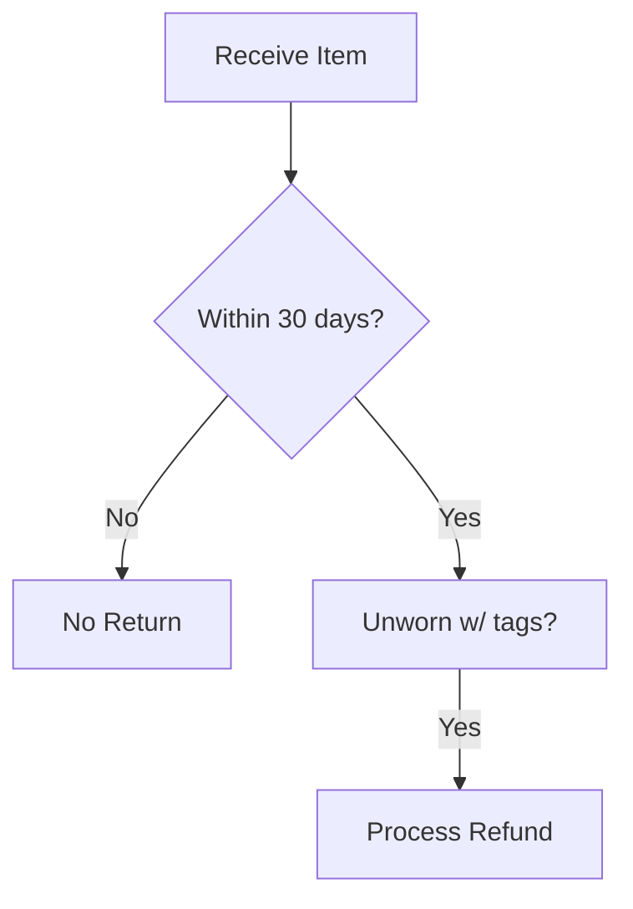

# Software Requirements Specification (SRS): Synthetic Retail Customer Support Dataset Generator

**Version:** 1.0  
**Date:** December 2, 2025  
**Author:** AI Assistant (based on analysis of 50+ real retail support pages)  
**Purpose:** Guide for Phase 1 of MSc research (see `proposed_method_summary.md`).

## 1. Introduction

### 1.1 Purpose

This SRS specifies a Python-based tool to generate a synthetic dataset of **100 interlinked Markdown (MD) files** mimicking realistic retail customer support documentation. The dataset serves as the structured Knowledge Base (KB) for evaluating RAG pipelines to mitigate LLM hallucinations in customer service chatbots.

The generator incorporates empirical patterns from analyzing 50+ real support pages (Target, Walmart, Amazon, etc.): topic frequencies, structures (tables, Mermaid diagrams), writing styles, common mistakes (30% injection), and 10% data rot (conflicting versions).

### 1.2 Scope

**In Scope:**

- Parse `structure.json` defining 100 pages' topology/topics/links/rot.
- LLM-generate MD content with headers, bold/italics, tables (tabular pages), Mermaid (logical), hyperlinks.
- Inject mistakes (30%), data rot (10%).
- Output `./kb/` with 100 `.md` files.
- `validate.py` for MD/link/Mermaid/rot checks.

**Out of Scope:** Query generation (Phase 1.4), RAG experiments (Phase 2).

**Assumptions:** OpenAI API access (GPT-4o for generation).

### 1.3 Definitions & Acronyms

- **KB**: Knowledge Base (100 MD files).
- **Data Rot**: 10% versioned pages with conflicts (e.g., `refund_policy_v1.md` (30 days) vs `_v2.md` (14 days)).
- **Mistake Types**: inconsistency, omission, poor_ux, outdated_info, accessibility_issue.
- **Page Types**: tabular (tables), logical/conditional (Mermaid flows), unstructured/mixed.

### 1.4 References

- `proposed_method_summary.md` (Phase 1 details).
- Empirical analysis summary (Section 2).

## 2. Overall Description

### 2.1 Product Perspective

Grounded in real-world analysis: High-freq topics (orders/returns 70%), mistakes (68% sites have inconsistencies), structures (3.2-level hierarchies).

### 2.2 Product Functions

1. Load `structure.json`.
2. Generate MD per page spec via LLM prompts.
3. Save MD files with relative links.
4. Run validation.

### 2.3 User Classes & Characteristics

- **Developers**: Python devs implementing generator for research replication.

## 3. Specific Requirements

### 3.1 External Interfaces

- **Input:** `structure.json` (see 4.1).
- **Output:** `./kb/*.md`, `dataset.jsonl` (optional metadata).
- **Dependencies:** `openai`, `pydantic`, `mermaid-cli` (validation), `markdownlint-cli`.

### 3.2 Functional Requirements

**FR1: Parse structure.json**

- Validate schema (Pydantic).
- Ensure 100 pages, ~10% rot pairs.

**FR2: Generate Content (Core)**

- For each page:
  - Prompt LLM: "Generate realistic MD for [category] [topics], [type]: include [tables/Mermaid/links], [style], [length]. [mistake if flagged]. Link to [links_to]."
  - Vary: styles (41% conversational), lengths (51% medium).
  - Topics from distributions (Table 3.2.1).

**FR3: Inject Mistakes (30% pages)**

- Probability 0.3.
- Types: inconsistency(40%), omission(28%), poor_ux(20%), outdated(8%), accessibility(4%).
- Severities: minor(58%), moderate(33%), major(9%).
- Inject via prompt: "Add [type] mistake of [severity]: e.g., contradictory policy."

**FR4: Data Rot (10%)**

- Versioned pairs with conflicts (e.g., policy dates).
- Cross-links between versions.

**FR5: Output MD Files**

- Dir: `./kb/`
- Filename: `slugified_title.md` (e.g., `refund_policy_v1.md`).
- Relative links: `[Policy v2](./refund_policy_v2.md)`.

**FR6: Validation Script**

- `validate.py`:
  - MD syntax (markdownlint).
  - Link resolution.
  - Mermaid syntax (`mmdc -p`).
  - Rot count ~10%.
  - Report issues.

#### Table 3.2.1: Topic Distributions (for structure.json population)

| Frequency    | Topics                                                                  | % Allocation (100 pages) | Category Adjustments      |
| ------------ | ----------------------------------------------------------------------- | ------------------------ | ------------------------- |
| High (70%)   | Orders(14), Returns(13.5), Shipping(13), Contact(12.5), FAQ(17)         | 70 pages                 | Fashion +returns 30%      |
| Medium (22%) | Account(6.5), Payments(5.5), Membership(4.5), Product(3.5), Warranty(2) | 22 pages                 | Electronics +warranty 25% |
| Low (8%)     | Store(2.5), Accessibility(1.5), Install(2), Sustain(1), Recycle(1)      | 8 pages                  | Home +install 60%         |

Page Types: 40% tabular, 30% logical, 30% unstructured.

### 3.3 Non-Functional Requirements

- **Performance:** <1hr for 100 pages.
- **Reliability:** 95% valid MD/links.
- **Usability:** CLI: `python generate.py --config structure.json`.
- **Portability:** Python 3.10+, Linux/Mac.
- **Security:** API keys via env vars.

## 4. Data Requirements

### 4.1 structure.json Schema

```json
{
  "num_pages": 100,
  "page_types": { "tabular": 40, "logical": 30, "unstructured": 30 },
  "rot_pairs": [
    // 10 pairs for 10% rot
    {
      "v1": "refund_policy_v1",
      "v2": "refund_policy_v2",
      "conflict": "30 vs 14 days"
    }
  ],
  "pages": [
    // 100 entries
    {
      "id": "refund_policy_v1",
      "title": "Refund Policy v1",
      "filename": "refund_policy_v1.md",
      "category": "general_retail",
      "type": "tabular",
      "primary_topic": "returns_refunds",
      "secondary_topics": ["return_window", "methods"],
      "style": "conversational_friendly",
      "length": "medium",
      "mistake": { "type": "inconsistency", "severity": "minor" },
      "links_to": ["shipping.md", "contact.md"],
      "requires_table": true,
      "requires_mermaid": false
    }
  ]
}
```

### 4.2 Metadata Output (optional dataset.jsonl)

Per report JSON schema (doc_id, shop, etc.).

## 5. Supporting Information

### 5.1 Generation Algorithm Pseudocode

```python
import openai
import json
from pydantic import BaseModel

class Page(BaseModel):
    # schema fields...

def generate_dataset(config_path: str):
    with open(config_path) as f:
        config = json.load(f)

    pages = config['pages']
    kb_dir = './kb'
    os.makedirs(kb_dir, exist_ok=True)

    for page in pages:
        prompt = build_prompt(page)  # topics, style, mistake, links...
        response = openai.chat.completions.create(
            model='gpt-4o',
            messages=[{'role': 'user', 'content': prompt}]
        )
        md_content = response.choices[0].message.content

        with open(f"{kb_dir}/{page.filename}", 'w') as f:
            f.write(f"# {page.title}\n\n{md_content}")

    subprocess.run(['python', 'validate.py', kb_dir])
```

### 5.2 Sample structure.json Snippet

```json
{
  "pages": [
    {
      "id": "returns_policy",
      "title": "Returns and Refunds Policy",
      "filename": "returns_policy.md",
      "category": "fashion",
      "type": "logical",
      "primary_topic": "returns_refunds",
      "secondary_topics": ["return_window"],
      "style": "corporate_formal",
      "length": "comprehensive",
      "mistake": null,
      "links_to": ["contact.md"],
      "requires_table": true,
      "requires_mermaid": true
    },
    {
      "id": "policy_v1",
      "title": "Refund Policy v1",
      "filename": "refund_policy_v1.md",
      "category": "general_retail",
      "type": "tabular",
      "primary_topic": "returns_refunds",
      "mistake": { "type": "inconsistency", "severity": "moderate" },
      "links_to": ["refund_policy_v2.md"]
    }
  ],
  "rot_pairs": [
    {
      "v1": "policy_v1",
      "v2": "policy_v2",
      "conflict": "30-day vs 14-day refunds"
    }
  ]
}
```

### 5.3 Sample Generated MD (returns_policy.md)

````markdown
# Returns and Refunds Policy

At RetailCo, returns are easy within **30 days of delivery** (or 14 days for sale items).

## Return Methods

| Method | Cost           | Time     |
| ------ | -------------- | -------- |
| Mail   | Free (members) | 5-7 days |
| Store  | Free           | Instant  |


````

[Contact Us](./contact.md) for issues.
[Note: Minor inconsistency - later mentions 'purchase date'.]

```

### 5.4 Empirical Background Summary
- Analyzed 50+ sites (Walmart, Amazon, etc.).
- Core topics: Orders/Returns/Shipping/Contact/FAQ (70%).
- Mistakes: Inconsistencies (68% sites), omissions (52%).
- Structures: Tables for policies, Mermaid-eligible flows for processes.

## 6. Verification & Validation
- Unit tests: Prompt building, schema validation.
- Integration: Generate sample 10 pages, manual review.
- Acceptance: 100 valid MD, ~10% rot, distributions match Table 3.2.1.

**End of SRS**
```
